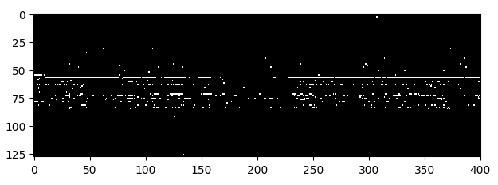

# SMAI Project Handout Document

> _Team_: Team 1
> 
> _Project ID_: 11

----

### Difference in Playing Styles of Different Composers

Fig. 1 

### Cellular Automata Output

Fig. 2 Here y-axis denote the notes number and x-axis denote time. White Ones are on and Black ones are off

### MLP

Fig. 3 MLP Architecture

Fig. 4 Output of MLP. Here y-axis denote the key pressed and the x-axis denote the time. White Ones are presses and Black ones are not pressed

### LSTM

Fig. 5 LSTM Architecture

Fig. 6 Output of LSTM. Here y-axis denote the key pressed and the x-axis denote the time. White Ones are presses and Black ones are not pressed

### Encoder Decoder

Fig. 7 Encoder Decoder Architecture

Mozart             | Beethoven
:-------------------------:|:-------------------------:
  |  

Fig. 8 Output of Encoder Decoder. Here y-axis denote the key pressed and the x-axis denote the time. White Ones are presses and Black ones are not pressed

### Classifier

Fig. 9 Outputs of the Classifier on the various shown midi files

